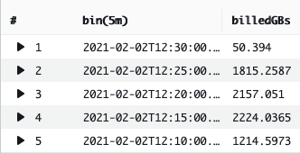
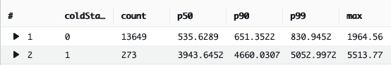
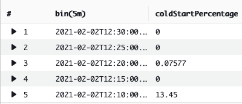

Amazon CloudWatch Logs Insights queries
=======================================

## Performance

### Billed duration in GB-s

Calculated the total billed duration in GB-s over 5 minutes interval periods.



```
filter @type = "REPORT"
| stats sum(@billedDuration)/1000 * avg(@memorySize)/1024000000 as billedGBs by bin(5m)
```

### Compare cold starts to warm starts

This show the total count and total duration at the 50th, 90th and 99th percentile for execution with and without cold starts.



```
filter @type="REPORT"
| fields greatest(@initDuration, 0) + @duration as duration, ispresent(@initDuration) as coldStart
| stats count(*) as count, pct(duration, 50) as p50, pct(duration, 90) as p90, pct(duration, 99) as p99, max(duration) as max by coldStart
```

### Percentage of cold starts

Calculates the percentage of cold start over 5 minutes interval periods.



```
filter @type = "REPORT"
| stats greatest(count(@initDuration)/count(@duration)*100, 0) as coldStartPercentage by bin(5m)
```

## Errors

### Latest 20 errors or warnings

Displays the last 20 error or warning log entries.

__Note:__ this requires using structured logging. See [this section of the Serverless Lens](https://docs.aws.amazon.com/wellarchitected/latest/serverless-applications-lens/centralized-and-structured-logging.html) for more information about structured logging.

```
fields @timestamp, @message
| filter level in ["ERR", "ERROR", "WARN", "WARNING"]
| sort @timestamp desc
| limit 20
```

### Number of error messages

Counts the number of error messages over 5 minutes interval periods.

__Note:__ this requires using structured logging. See [this section of the Serverless Lens](https://docs.aws.amazon.com/wellarchitected/latest/serverless-applications-lens/centralized-and-structured-logging.html) for more information about structured logging.

```
filter level in ["ERR", "ERROR"]
| stats count() as numErrors by bin(5m)
```